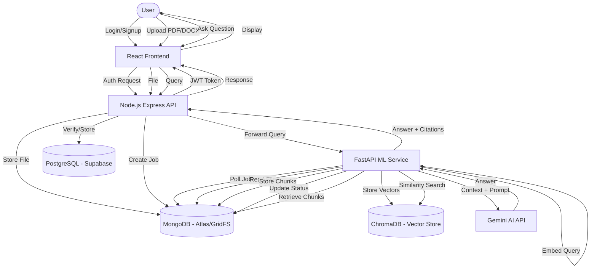

# DocuBrain Project Overview

This document provides a high-level overview of the DocuBrain enterprise RAG (Retrieval-Augmented Generation) knowledge base application.

## 🚀 Tech Stack

### Frontend
- **Framework**: React.js (Vite)
- **Styling**: Tailwind CSS
- **State Management**: React Context API
- **Real-time**: Socket.io-client
- **API Communication**: Axios (with JWT interceptors)

### Backend (Node.js API)
- **Framework**: Express.js
- **Primary Database**: PostgreSQL (via Supabase) — Handles user metadata, knowledge base settings.
- **Document Store**: MongoDB Atlas + GridFS — Stores file chunks, raw files, job queues, and chat history.
- **Logging**: Winston
- **Security**: JWT (Access/Refresh tokens), Helmet, Express Rate Limit

### ML Service (Python)
- **Framework**: FastAPI
- **Vector Database**: ChromaDB (Persistent)
- **Embeddings**: Sentence Transformers (`all-MiniLM-L6-v2`)
- **LLM**: Google Gemini API
- **Agent Orchestration**: LangChain + LangGraph
- **Logging**: Loguru

---

## 🔄 Project Flow

The following diagram illustrates the interaction between services for authentication, document ingestion, and RAG querying.



---

## 🔐 Authentication Files (Frontend)

The following files handle the Sign In and Sign Up functionality on the frontend:

- **`client/src/pages/LoginPage.jsx`**: The main login page UI and submission logic.
- **`client/src/pages/RegisterPage.jsx`**: The registration page UI and submission logic.
- **`client/src/context/AuthContext.jsx`**: Global authentication state provider. Handles user sessions, login/logout functions, and token storage.
- **`client/src/api/auth.api.js`**: Axios-based API calls to the Express backend for auth endpoints.
- **`client/src/api/axios.js`**: Axios instance configuration with interceptors for attaching JWT tokens and handling 401 refresh logic.

---

## 🛠️ How to Run the Project

### Option A: Using Docker (Recommended)
This is the fastest way to boot all services including databases.

1. Ensure Docker and Docker Desktop are running.
2. In the root directory, run:
   ```bash
   docker-compose up --build
   ```
3. Access the services:
   - **Frontend**: [http://localhost:3000](http://localhost:3000)
   - **Backend API**: [http://localhost:5000](http://localhost:5000)
   - **ML Service**: [http://localhost:8000](http://localhost:8000)

### Option B: Manual (Development Mode)
You will need Node.js, Python 3.10+, MongoDB, and PostgreSQL installed.

1. **Setup Backend (Node.js)**:
   ```bash
   cd server
   npm install
   npm run dev
   ```
2. **Setup ML Service (Python)**:
   ```bash
   cd ml
   python -m venv venv
   source venv/bin/activate  # or venv\Scripts\activate on Windows
   pip install -r requirements.txt
   uvicorn app.main:app --reload --port 8000
   ```
3. **Setup Frontend (React)**:
   ```bash
   cd client
   npm install
   npm run dev
   ```
